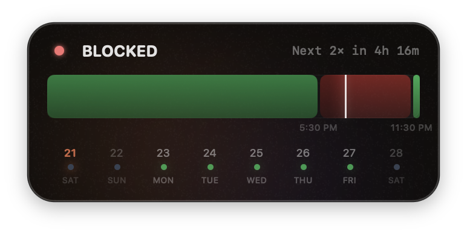
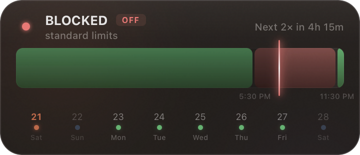
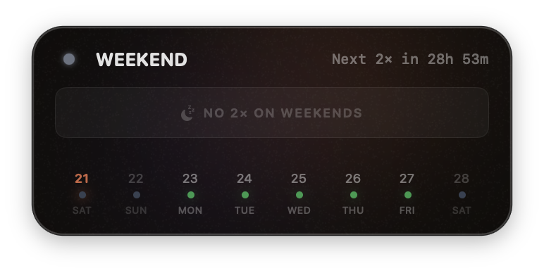
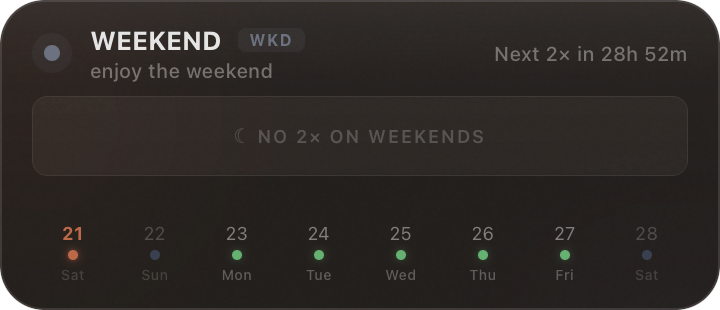

<div align="center">

# Claude 2x Tracker

**Know exactly when your Claude limits are doubled. Squeeze every last drop out of your subscription.**

*Because you're not paying $20/mo to use half the capacity. Go full send when the window is open.*

<br/>


<br/>

> **2x ACTIVE** -- double the limits, double the fun. ship that side project.
> **BLOCKED** -- peak hours. normie limits. go touch grass.
> **WEEKEND** -- no promo. touch even more grass.

</div>

---

## Why?

Claude Pro gives you **2x usage limits during off-peak hours**. That's literally double the prompts, double the context, double the output -- for the same subscription you're already paying for.

The catch? You have to know *when* the window is open. Miss it and you're back to normal limits, wondering why Claude cut you off mid-conversation.

This widget sits on your desktop and tells you exactly:
- Whether 2x is active **right now**
- A live 24-hour bar showing peak vs off-peak
- Countdown to the next window change
- An 8-day calendar to plan your heavy usage days

**No API calls. No internet required (except for schedule updates). Just math and your system clock.**

Stop guessing. Start shipping.

---

## The Schedule

All times auto-convert to **your local timezone**. The peak window is defined by Anthropic in ET.

| Day | Your Local Time | Status |
|---|---|---|
| Mon -- Fri | Outside peak window | **2x ACTIVE** -- go wild |
| Mon -- Fri | During peak window | **BLOCKED** -- standard limits |
| Sat -- Sun | All day | **WEEKEND** -- no promotion |

Peak window: **8 AM -- 2 PM Eastern Time** (auto-converted to your timezone on the bar).

Source: [Anthropic's official promotion page](https://support.anthropic.com/en/articles/14063676-claude-march-2026-usage-promotion)

> If Anthropic changes the schedule, we push one file update and all running apps pick it up automatically. No app update needed.

---

## Three Flavors

| | macOS Widget | System Tray App | KDE Plasma Widget |
|---|---|---|---|
| **Lives** | On your desktop wallpaper | In your system tray / menu bar | On your KDE desktop |
| **Covers** | macOS only | Windows + macOS + Linux | KDE Plasma (any distro) |
| **Feel** | Always visible, behind apps | Click tray icon to toggle | Native desktop widget |

Same dark glass look. Same live bar. Same vibe.

### Active (weekday, off-peak)

<p align="center">

&nbsp;&nbsp;

</p>

### Weekend

<p align="center">

&nbsp;&nbsp;

</p>

---

## Installation

### System Tray App (Windows / macOS / Linux)

**Recommended for most users.** Pre-built binaries on the [Releases](https://github.com/Xczer/claude-2x/releases) page.

Or build from source:

```bash
git clone https://github.com/Xczer/claude-2x.git
cd claude-2x/tray
npm install
cargo tauri build
```

**Requirements:** Rust 1.70+ and Node 18+

Click the **2X** icon in your system tray to toggle the popup. Right-click to quit.

---

### macOS Widget (native SwiftUI)

Floats on your desktop wallpaper. Draggable, remembers position, no dock icon.

```bash
git clone https://github.com/Xczer/claude-2x.git
cd claude-2x
open Claude2xWidget/Claude2xWidget.xcodeproj
# Cmd+R to build and run
```

**Requirements:** macOS 13+ and Xcode 15+

**Auto-launch on login:** System Settings -> General -> Login Items -> add Claude2xWidget.app

**If macOS blocks the app:**
```bash
xattr -cr /Applications/Claude2xWidget.app
```

---

### KDE Plasma Widget

Native QML widget for KDE Plasma 5 or 6.

```bash
git clone https://github.com/Xczer/claude-2x.git
cd claude-2x/kde-widget
chmod +x install.sh && ./install.sh
```

Right-click desktop -> "Add Widgets..." -> search "Claude 2x Tracker".

---

## Configuration

The tray app reads `config.json` for local overrides. Schedule priority:

1. **Remote `schedule.json`** (fetched from this repo every 6 hours)
2. **Local `config.json`** (next to the binary)
3. **Hardcoded defaults**

```json
{
  "timezone": "America/New_York",
  "active_days": ["monday", "tuesday", "wednesday", "thursday", "friday"],
  "blocked_window": {
    "start": "08:00",
    "end": "14:00"
  }
}
```

You shouldn't need to touch this unless you want custom overrides.

---

## Project Structure

```
claude-2x/
|
|-- schedule.json                  <- Remote schedule (apps auto-fetch this)
|-- config.json                    <- Local override for tray app
|-- README.md
|-- LICENSE
|
|-- Claude2xWidget/                <- macOS native widget (Swift + SwiftUI + AppKit)
|   |-- Claude2xWidget/
|       |-- StatusEngine.swift     <- All time logic + remote config fetch
|       |-- ContentView.swift      <- The UI (status, bar, calendar)
|       |-- FloatingWindow.swift   <- Desktop window (drag, snap, persist)
|       |-- AppDelegate.swift      <- App entry point
|       |-- Views/                 <- Extra view components
|
|-- tray/                          <- System tray app (Tauri 2 -- Rust + JS)
|   |-- src/
|   |   |-- index.html, style.css, main.js
|   |-- src-tauri/
|       |-- src/lib.rs             <- Status engine + remote config + tray logic
|       |-- Cargo.toml
|       |-- tauri.conf.json
|
|-- kde-widget/                    <- KDE Plasma widget (QML + JavaScript)
|   |-- package/
|   |   |-- metadata.json
|   |   |-- contents/ui/main.qml  <- Everything in one file
|   |-- install.sh
|
|-- .github/workflows/build.yml   <- CI: builds tray app for all platforms
```

---

## How the logic works

```
IF weekend (in your local timezone)
  -> WEEKEND (no promotion)

ELSE IF current time is in the peak window (8-2 PM ET, converted to local)
  -> BLOCKED (standard limits)

ELSE
  -> 2x ACTIVE (double limits -- go ship something)
```

That's it. Everything else is just making it look good.

---

## Schedule Updates

When Anthropic changes the peak hours (it has happened before), we update `schedule.json` in this repo. All three apps fetch it automatically every 6 hours. No app update, no rebuild, no action needed from you.

---

## Contributing

PRs welcome:

- Test on Windows / Linux and report issues
- Add screenshots of the widget on your setup
- Report bugs, suggest features
- Help with the KDE widget (untested on real Plasma desktops)

---

## FAQ

**Does this use the Claude API?**
No. Pure local time math. No API key, no cost.

**Will it drain my battery?**
Negligible. ~0.1% CPU.

**Why should I care about 2x limits?**
Because you're paying for Pro/Max and you want to juice every last prompt out of it. More context, more output, more conversations -- all during off-peak. Plan your heavy Claude sessions around the 2x window and you'll never hit "usage limit reached" again.

**Can I use this for something other than Claude?**
Yes. It's a configurable "am I inside or outside a time window" tracker.

---

## License

MIT. Take it, fork it, build on it.

---

<div align="center">

**macOS widget -- System tray app -- KDE Plasma widget**

*Built because staring at the clock is not a productivity strategy.*
*Also built entirely by Claude. Yes, the irony is not lost on us.*

</div>
